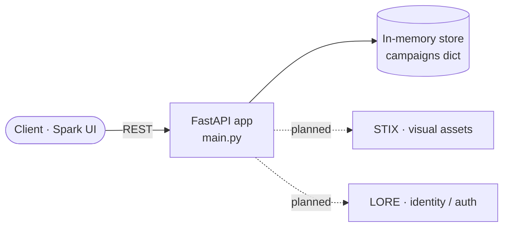
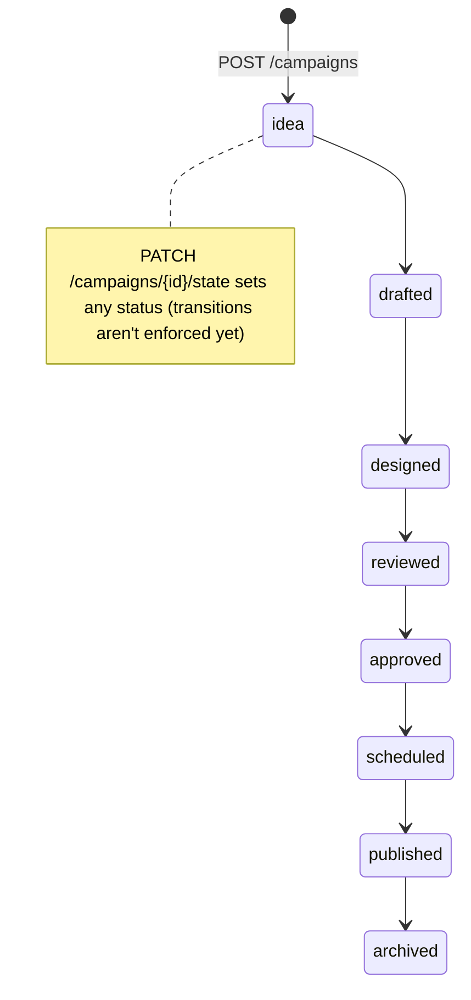

# Syndical Core

**FastAPI campaign engine — the campaign lifecycle as an explicit state machine**


The core of Syndical, a campaign-management backend. The current code is a small **FastAPI** service (`main.py`) that creates campaigns (name and "aura"), lists them and moves each one through an explicit status pipeline: `idea → drafted → designed → reviewed → approved → scheduled → published → archived`. State is kept **in memory** for now. The target design is in [`docs/architecture.md`](docs/architecture.md): template-driven content generation, a human-in-the-loop review, scheduling, a swappable publisher and an append-only audit log, with UI, visuals and identity owned by the sibling systems Spark, STIX and LORE. It's for developers building the Syndical campaign pipeline.

## Architecture



### Campaign status pipeline (as implemented)



## Stack

- Python, FastAPI, Pydantic v2
- Uvicorn (ASGI server)

## Project structure

```text
main.py               FastAPI app: models + endpoints (in-memory)
requirements.txt      fastapi, uvicorn[standard], pydantic
docs/architecture.md  target architecture, pipeline states, planned /api/v1 surface
```

## Deploy

There's no deploy configuration in the repository yet. Run it with any ASGI host, e.g. `uvicorn main:app`. Data doesn't persist across restarts.
